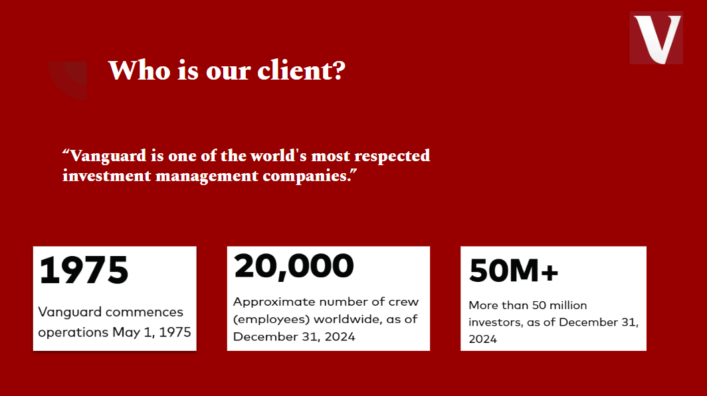
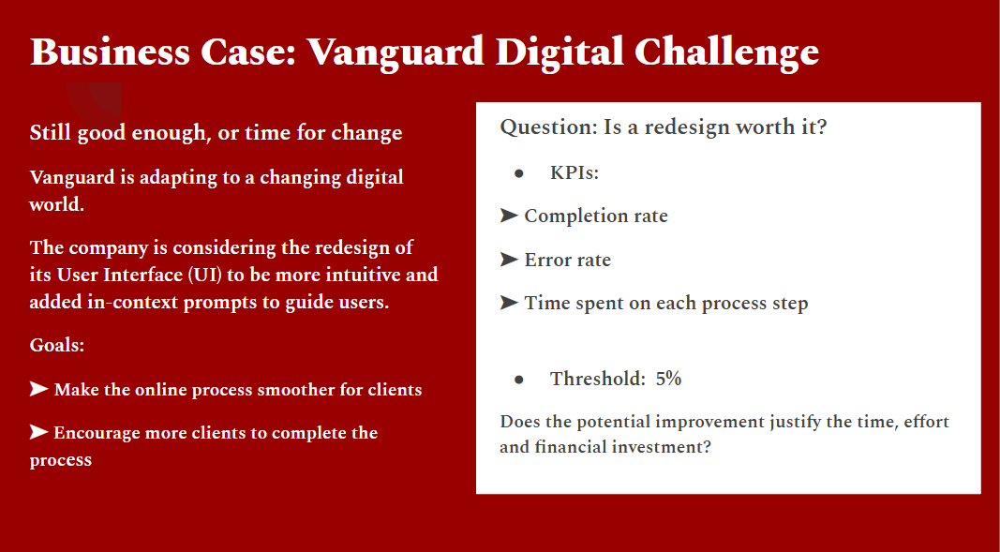
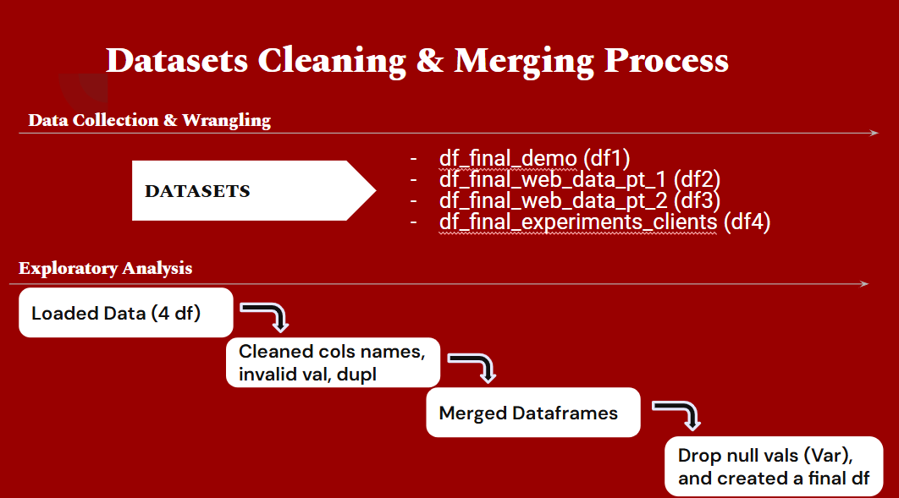
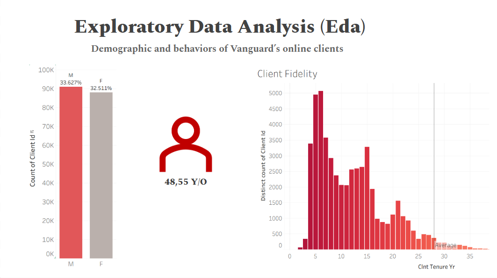
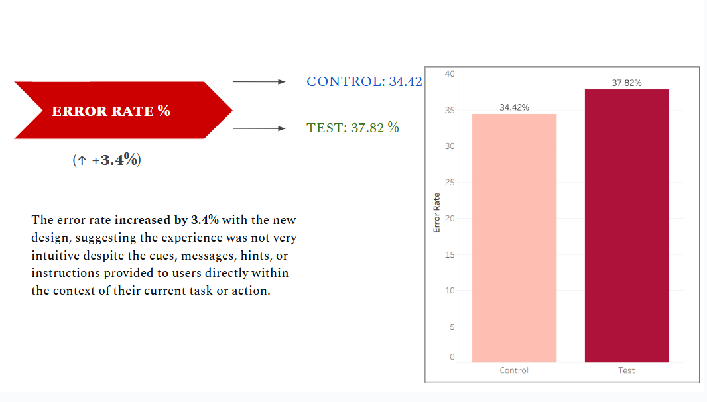

# Vanguard CX A/B Test , Is a UI Redesign Worth It?

>  **Team project (Ironhack). My role:** Exploratory Data Analysis (EDA), hypothesis testing (two-proportion z-test + confidence intervals), and business recommendations.

We tested a new UI for Vanguard to see if it actually improves customer experience.  
**KPIs:** Completion Rate, Error Rate, Time per Step.  
**Business bar:** +5% completion uplift.

---

## Preview

### Who is the client?
Vanguard is one of the world’s most respected investment management companies.

---

### Business case
Vanguard considered redesigning its onboarding UI to make the process smoother and encourage higher client conversion.  
**Key question:** *Is the redesign worth the investment?*

---

### Data pipeline
We collected four datasets, cleaned and merged them into one.  
Steps included: renaming columns, removing duplicates/invalid values, and dropping nulls in key variables.

---

### Are groups comparable? (EDA)
Control and Test groups had similar demographics.  
- Age ~48 years on average  
- Tenure mostly 5–15 years  
- Gender distribution balanced  

This means the A/B test is valid and representative.

---

### One key result
✅ Completion improved (+3.7 pp).  
❌ Error rate also increased (+3.4 pp).  

Users finished more often, but with more mistakes.  

---

## Results in numbers

| Metric       | Control | Test | Δ (Test – Control) |
|--------------|---------|------|--------------------|
| Completion % | 65.6    | 69.3 | +3.7 pp            |
| Error rate % | 34.4    | 37.8 | +3.4 pp            |
| Avg. time    | Mixed   | Mixed| Faster at Step 2 & 3, slower at Confirm |

---

## Hypothesis testing

- **Null (H0):** No improvement in completion.  
- **Alt (H1):** Test has higher completion.  
- **Result:** Statistically significant (p < 0.001).  
- **But:** Business threshold of +5% uplift was not reached.  

---

## Recommendations

1. Do not roll out the redesign fully yet.  
2. Optimize **Step 1** and **Confirm page** (too slow, more hesitation).  
3. Keep the improvements from Step 2 and Step 3.  
4. Re-run the experiment after fixes.  

---

## Tools & Collaboration

- **Python + Jupyter** — cleaning, EDA, z-test  
- **Tableau** — visual storytelling  
- **Excel** — preprocessing  
- **Trello & Slack** — teamwork & communication  

---

## Project files

- Notebook → `project5_egbe.ipynb`  
- Images → `/images/` (EDA & results)  
- Slides → [Google Slides](https://docs.google.com/presentation/d/1Oi1EdEt2b-jIIuWHGRSOk-RvK7pxw20mUzWgaJEXhXc/edit?usp=sharing)  

---

## Author

👩🏽‍💻 Egbe Grace — Data Analyst  
GitHub: [Egbe34](https://github.com/Egbe34)
